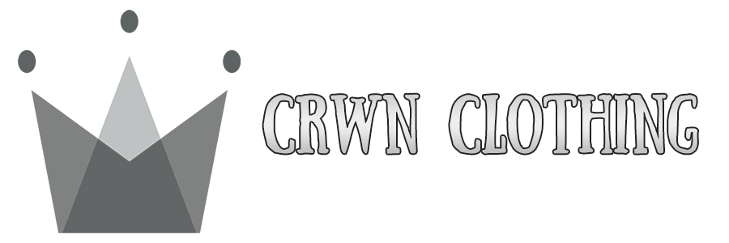

<!-- PROJECT LOGO -->

<br />
<p align="center">
  <a href="https://crwn-clothing-stekatag.netlify.app/">
    
  </a>

  <!-- STATUS BADGES -->

  <p align="center">
    
    <a href="LICENSE.txt" style="text-decoration: none;">
      
    </a>
    
  </p>

  <h3 align="center">Crwn Clothing</h3>

  <p align="center">
    An e-commerce app for shopping clothes like hats, jackets, and sneakers for men and women. Built with React, TypeScript, Redux, Sagas, and Firebase.
    <br />
    <a href="#about-the-project"><strong>Explore the docs »</strong></a>
    <br />
    <br />
    <a href="https://crwn-clothing-stekatag.netlify.app/">View Demo</a>
    ·
    <a href="https://github.com/stekatag/crwn-clothing/issues">Report Bug</a>
    ·
    <a href="https://github.com/stekatag/crwn-clothing/issues">Request Feature</a>
  </p>
</p>

<!-- TABLE OF CONTENTS -->

## Table of Contents

<details open="open">
  <summary>Table of Contents</summary>
  <ol>
    <li>
      <a href="#about-the-project">About The Project</a>
      <ul>
        <li><a href="#built-with">Built With</a></li>
      </ul>
    </li>
    <li>
      <a href="#getting-started">Getting Started</a>
      <ul>
        <li><a href="#prerequisites">Prerequisites</a></li>
        <li><a href="#installation">Installation</a></li>
      </ul>
    </li>
    <li><a href="#usage">Usage</a></li>
    <li><a href="#roadmap">Roadmap</a></li>
    <li><a href="#contributing">Contributing</a></li>
    <li><a href="#license">License</a></li>
    <li><a href="#acknowledgements">Acknowledgements</a></li>
  </ol>
</details>

<!-- ABOUT THE PROJECT -->

## About The Project

[![Product Name Screen Shot][product-screenshot]](https://crwn-clothing-stekatag.netlify.app/)

Crwn Clothing is an e-commerce app for shopping jackets, hats, sneakers, and many more for both men and women The app is built using React, TypeScript, Redux, Redux Sagas, and Firebase for storing data.

The app allows users to:

- Browse and search for various clothing items.
- Add items to their shopping cart.
- Checkout and make purchases securely using Firebase.
- View and manage their order history.

### Built With

This app is built using the following technologies:

- [React](https://reactjs.org/)
- [TypeScript](https://www.typescriptlang.org/)
- [Redux](https://redux.js.org/)
- [Redux Sagas](https://redux-saga.js.org/)
- [Firebase](https://firebase.google.com/)
- [Stripe](https://stripe.com/)

<!-- GETTING STARTED -->

## Getting Started

To get started with the project, you can either fork this repository or download it locally to your system.

To get a local copy up and running, follow these simple example steps.

### Prerequisites

Make sure you have the latest version of NPM installed to avoid any errors:

- npm
  ```sh
  npm install npm@latest -g
  ```

### Installation

1. Clone the repo
   ```sh
   git clone https://github.com/stekatag/crwn-clothing.git
   ```
2. Move into the project directory
   ```sh
   cd crwn-clothing
   ```
3. Install NPM packages
   ```sh
   npm install
   ```
4. Configure Firebase:

- Go to **Firebase** and create a new project.
- Obtain your Firebase configuration settings.
- Replace the Firebase config in `src/utils/firebase/firebase.utils.ts` with your own config.

5. Start the development server
   ```sh
   npm run dev
   ```

<!-- USAGE EXAMPLES -->

## Usage

0. Create an account or login to the app. (not required)

1. Browse through the available clothing items in the app.

2. Add items to your shopping cart.

3. Proceed to checkout page to make a demo purchase using Stripe.

<!-- ROADMAP -->

## Roadmap

See the [open issues](https://github.com/stekatag/crwn-clothing/issues) for a list of proposed features (and known issues).

### Proposed features

1. Implement a search feature for searching items by name.

2. Saving the cart items in the database for logged in users.

3. Allow users to filter products by categories, sizes, and prices.

4. Implement a wish list feature for saving favorite items.

<!-- CONTRIBUTING -->

## Contributing

Contributions are what make the open source community such an amazing place to be learn, inspire, and create. Any contributions you make are **greatly appreciated**.

1. Fork the Project
2. Create your Feature Branch (`git checkout -b feature/AwesomeNewFeature`)
3. Commit your Changes (`git commit -m 'Add some AwesomeNewFeature'`)
4. Push to the Branch (`git push origin feature/AwesomeNewFeature`)
5. Open a Pull Request

<!-- LICENSE -->

## License

Distributed under the MIT License. See [license](https://github.com/stekatag/crwn-clothing/blob/master/LICENSE.txt) for more information.

<!-- MARKDOWN LINKS & IMAGES -->

[product-screenshot]: public/product-screenshot.jpg
